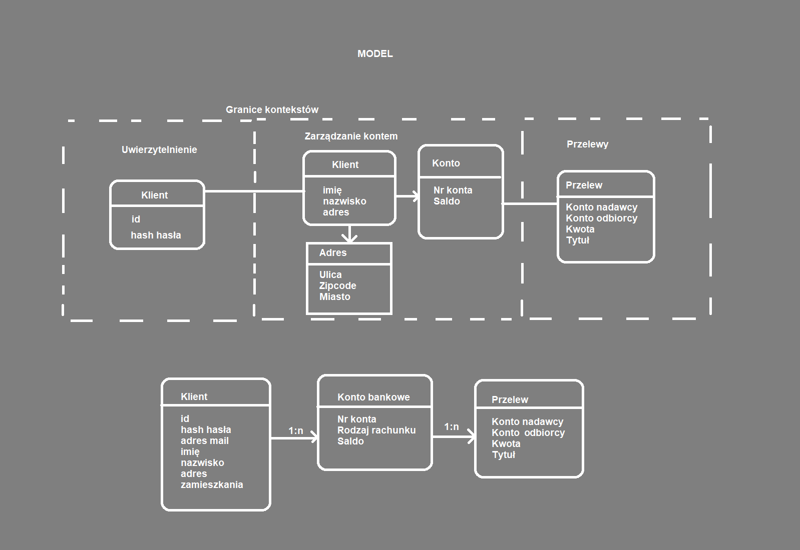

# Domain Driven Design

## Opis

Zadanie polega na zamodelowaniu bezpiecznej aplikacji bankowej wykorzystując zasady Domain Driven Design. Przykładem jest instytucja banku. Bank umożliwia rejestrację klienta po podaniu jego danych osobowych. Klient, gdy jest już zarejestrowany ma możliwość założenia sobie kont bankowych. Każde konto bankowe jest przypisane do jednego klienta i ma swoje saldo i historię rachunku. Z danego konta bankowego możliwe jest wykonanie przelewu. Przelew to transakcja pieniężna z konta nadawcy na konto odbiorcy, która ma swoją kwotę i opis słowny.

### Zdefiniowanie kontekstów

W naszej domenie istnieją trzy konteksty:

- Uwierzytelnienie - pozwala klientowi na potwierdzenie jego tożsamości
- Zarządzanie kontem - daje klientowi dostęp do danych o jego kontach
- Przelewy - Wykonywanie przelewów i historia przelewów

### Encje

- Klient - reprezentuje jedną osobę fizyczną
- Konto bankowe - reprezentuje konto bankowe przypisane do jednego Klienta
- Przelew - reprezentuje jedną transakcję pieniężną z określonego Konta na określone Konto

### Obiekty wartości

- Id - ciąg znaków w formacie UUID-4
- Adres - składa się z ulicy, kodu pocztowego oraz miasta
- Ulica - String 3-30 znaków
- Kod pocztowy - 5 cyfr
- Kwota przelewu - wartość zmiennoprzecinkowa > 0
- Saldo - wartość zmiennoprzecinkowa
- Numer konta - ciąg znaków zgodny ze standardem numeru IBAN
- Imię - String 3-20 znaków
- Nazwisko - String 3-20 znaków
- Hash hasła - ciąg w formacie zgodnym z SHA-256
- Tytuł przelewu - String 0-140 znaków

### Agregat

Istnieje agregat Klienta, który zawiera korzeń w postaci klienta. Następnie do klienta jest dołączone konto bankowe, a do niego Przelew.

